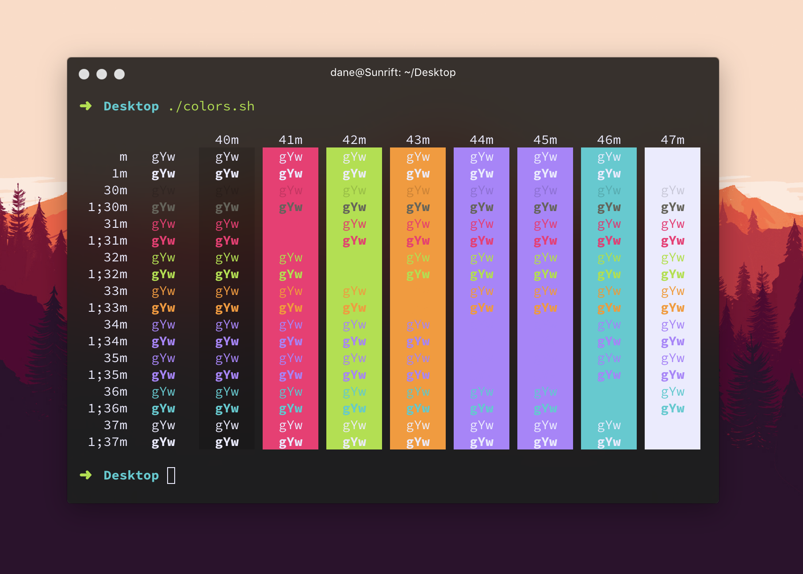

# hyper-firenokai

A theme for [Hyper](https://hyper.is/) that combines the best of [Evan Sims](https://github.com/evansims)' [hyper-firewatch](https://github.com/evansims/hyper-firewatch) theme with the best of [Nikolay Kostyurin](https://github.com/jilizart)'s [hyper-monokai-vibrancy](https://github.com/JiLiZART/hyper-monokai-vibrancy) theme.

* Started with `hyper-firewatch` as a base theme
* Swapped out Firewatch color palette for Monokai palette
* Added left padding to first tab to prevent title from running under macOS window controls

I've only been tested this theme on macOS Sierra, so I cannot attest to the experience on other platforms.

Issues are open and pull requests are welcome.

### About hyper-firewatch

Inspired by Campo Santo's [Firewatch game](http://www.firewatchgame.com/). Adapted from [Sebastian Szturo](https://github.com/SebastianSzturo)'s [Atom syntax theme](https://atom.io/themes/firewatch-syntax), and forked from [Ben Styles'](https://github.com/leeds-ebooks) [hyperterm-firewatch](https://github.com/leeds-ebooks/hyperterm-firewatch) theme. This fork makes a number of changes to the theme, including:

* Removed window and tab borders for a flatter, cleaner look
* Added further color variations
* Added background colors to inactive tabs
* Added dark vibrancy support

## Install

In Hyper, open Preferences, add `hyper-firenokai` to the plugins list in your `~/.hyper.js` config file.

## License

MIT © [Dane Petersen](https://thegreatsunra.com), [Evan Sims](http://evansims.com), [Ben Styles](http://leeds-ebooks.co.uk), [Nikolay Kostyurin](http://artkost.ru), [Badr Chaouai](http://arkhamdev.com/)
